# 목차

1. **[서비스 소개](#서비스-소개)**
2. **[기획 배경](#기획-배경)**
3. **[시연 화면](#시연-화면)**
4. **[기술 스택](#기술-스택)**
5. **[프로젝트 일정 및 산출물](#프로젝트-일정-및-산출물)**
6. **[프로젝트 폴더 구조](#프로젝트-폴더-구조)**
7. **[개발 멤버](#개발-멤버)**

---

# 서비스 소개

[](https://youtu.be/tXu6pf21o6c)


### 🔹 개요

- 한줄 소개 : 편리한 대형마트 장보기
- 서비스명 : mmARt

### 🔹 타겟

- 오프라인 대형마트에서 효율적인 쇼핑을 원하는 사람들

# 기획 배경

### 🔹 배경
오프라인 대형마트 쇼핑에서의 불편함 발견
1. 물건이 너무 많다보니 어떤 물건이 어디 있는지 찾기 어렵고, 매번 직원분께 물어보기에도 번거롭다.
2. 물건의 리뷰를 일일이 검색해서 확인하기 불편하다.
3. 결제할 때 여러 물건을 다시 꺼내서 바코드를 찍기 불편하다.


### 🔹 목적

1. 사용자가 원하는 물건의 위치를 AR를 통해 안내 받을 수 있다.
2. 물건의 최저가와 리뷰를 바로 확인해서 물건을 선택하는 데 도움이 될 수 있다.
3. 사용자의 편의를 위해 모든 사용자들이 일반적으로 가지고 있는 핸드폰 카메라를 이용하여 장바구니에 들어간 품목들의 바코드를 인식하여 나갈 때 수동적인 결제없이 자동 결제가 가능하다.


### 🔹 의의

- 대형마트에서 물건을 간편하게 찾고, 찾은 물건의 최저가와 리뷰를 편리하게 확인하고 결제할 수 있어 효율적인 쇼핑이 가능하다.
- 기존 카트에 앱을 설치한 핸드폰을 거치하면, 큰 비용을 들이지 않고 서비스 적용이 가능하다.


# 시연 화면
|회원가입|로그인|로그아웃|
|:------:|:------:|:------:|
||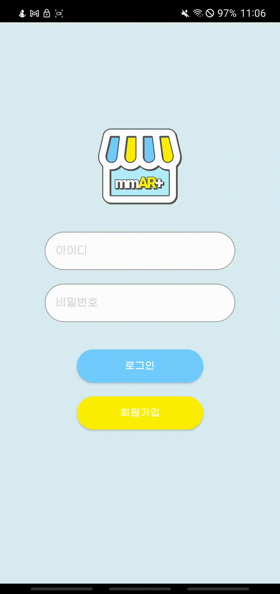||


|상품 검색|상품 상세조회|바코드로 상품 조회|
|:------:|:------:|:------:|
|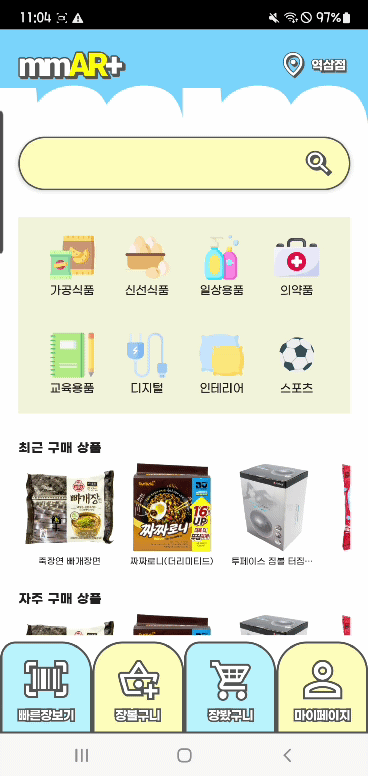|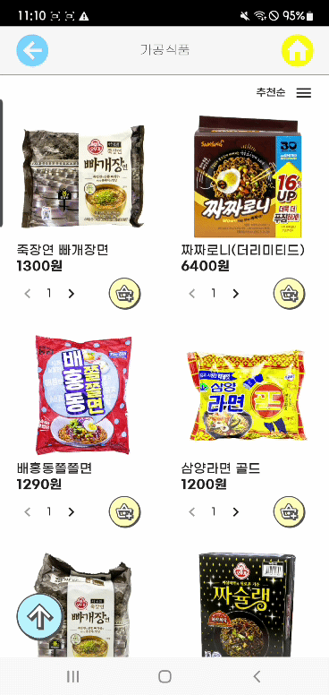|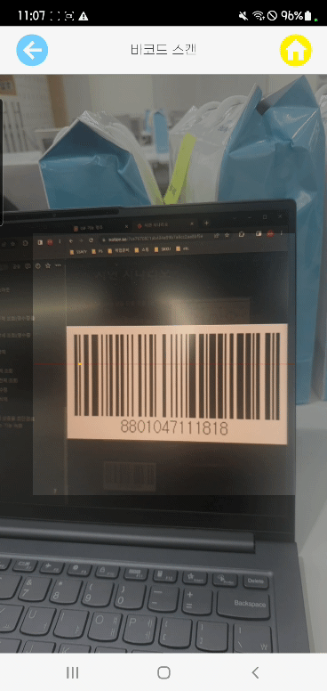|

|장볼구니-추가|장볼구니-수정|장볼구니-삭제|
|:------:|:------:|:------:|
||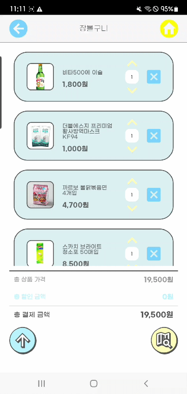|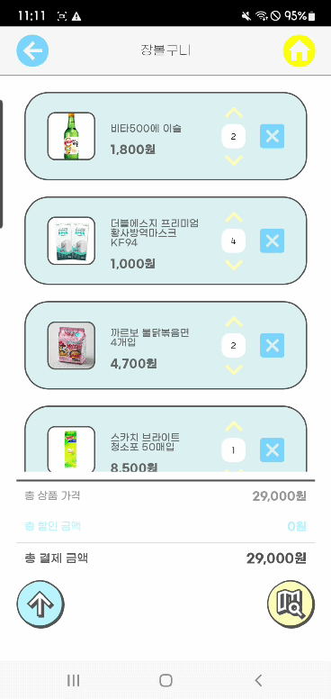|

|AR네비게이션-쇼핑 시작|최적의 경로 안내|AR네비게이션-쇼핑 마무리|
|:------:|:------:|:------:|
||||

|장봤구니-추가|장봤구니-수정|장봤구니-삭제|장봤구니-결제|
|:------:|:------:|:------:|:------:|
|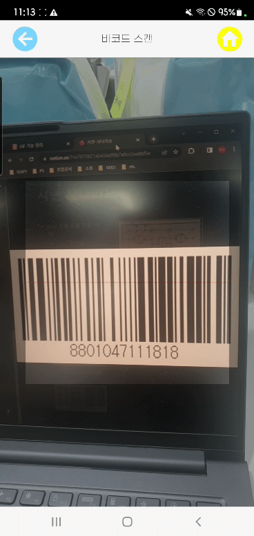|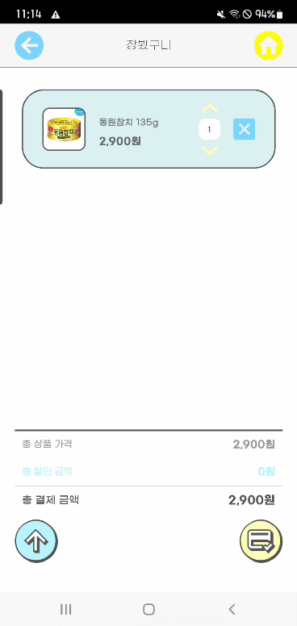||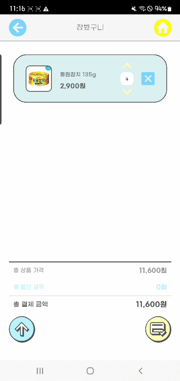|

|리뷰-작성 및 긍부정분류|리뷰-수정|리뷰-삭제|
|:------:|:------:|:------:|
|||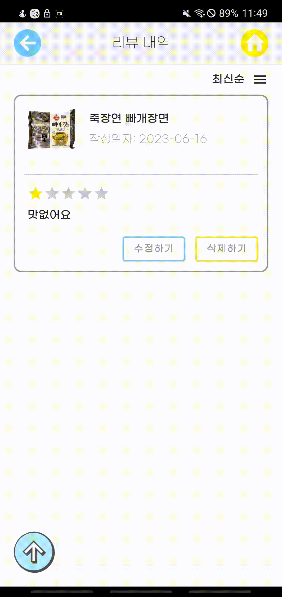|


# 기술 스택


### 🔹 [AI]
- BERT
- TensorFlow
- Python
- FastAPI

### 🔹 [FE]

- Kotlin
- Unity
- Android
- Jetpack Compose

### 🔹 [BE]

- Java
- Spring Boot
- Elasticsearch
- Python
- Tensorflow

### 🔹 [DB]
- MySQL
- Redis
- S3

### 🔹 [Infra]
- Docker
- Jenkins
- K8s

### 🔹 [개발환경 및 협업툴]

- Version Control
    - GitLab
- Agile Tool
    - Jira
- Communication
    - Mattermost
    - Webex
    - Notion
- API Documentation
    - Swagger UI
- OS
    - Windows 10
- UI/UX
    - Figma
- IDE
    - Visual Studio Code 1.75
    - Android Studio 2022.1.1
    - Intellij IDEA 2022.3.1
    - Google Colab
- DB
    - MySQL 8
    - Redis 7
    - Elasticsearch 7.16.1
    - AWS S3
- Server
    - AWS EC2
        - Ubuntu 20.04 LTS
        - Docker 23.0.4
        - Docker Compose 2.17.2
        - Jenkins 2.387.1
    - GCP GKE
        - client 1.27.1
        - server 1.24.10-gke.2300
        - helm 3.9.3
- WAS
    - Apache Tomcat 9.0.71
- AI
    - Python 3.9
    - TensorFlow 2.12.0
    - FastAPI 0.95.0
- FE
    - Unity 2021.3.22f1
    - Kotlin 1.8.20
    - Jetpack Compose 1.2.0
- BE
    - OpenJDK 11
    - Kotlin 1.8.20
    - Spring Boot Gradle(Kotlin) 2.7.11
        - Spring Data JPA
        - Spring Data Redis

# 프로젝트 일정 및 산출물

### 🔹 프로젝트 일정

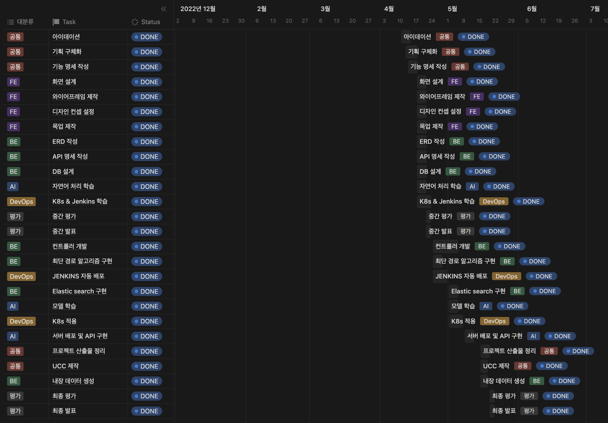

### 🔹 프로젝트 산출물

#### - (1) Figma

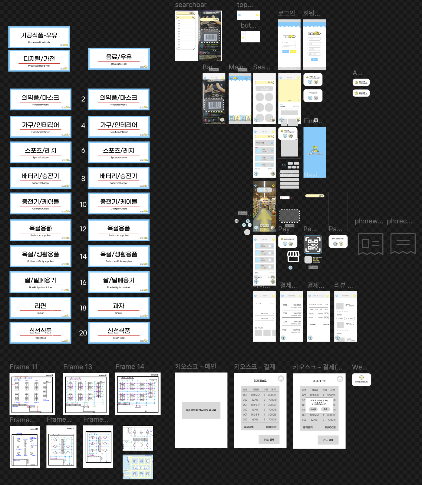

#### - (2) ERD


#### - (3) API 문서 (서버 만료)

[SWAGGER](https://j8a401.p.ssafy.io/swagger-ui/index.html#/)

#### - (4) API 명세서


# 프로젝트 폴더 구조

### 🔹 AI

```bash
+---sentiment_analysis
|   +---app
|   |   \---model
|   |       \---ns_bert_1_epoch
|   |           +---assets
|   |           \---variables
|   \---local
|       \---__pycache__
\---shortest-path
    +---app
    \---local
        \---__pycache__
```

### 🔹 BE

```bash
+---.gradle
|   +---7.6.1
|   |   +---checksums
|   |   +---dependencies-accessors
|   |   +---executionHistory
|   |   +---fileChanges
|   |   +---fileHashes
|   |   \---vcsMetadata
|   +---buildOutputCleanup
|   \---vcs-1
+---.idea
+---gradle
|   \---wrapper
\---src
    +---main
    |   +---kotlin
    |   |   \---com
    |   |       \---ssafy
    |   |           \---mmart
    |   |               +---config
    |   |               +---controller
    |   |               +---domain
    |   |               |   +---category
    |   |               |   |   \---dto
    |   |               |   +---favorite
    |   |               |   |   \---dto
    |   |               |   +---favoriteCategory
    |   |               |   +---getCart
    |   |               |   |   \---dto
    |   |               |   +---gotCart
    |   |               |   |   \---dto
    |   |               |   +---item
    |   |               |   |   \---dto
    |   |               |   +---itemCoupon
    |   |               |   |   \---dto
    |   |               |   +---itemDetail
    |   |               |   +---itemDetailImage
    |   |               |   |   \---dto
    |   |               |   +---itemItemCoupon
    |   |               |   +---payment
    |   |               |   |   \---dto
    |   |               |   +---paymentDetail
    |   |               |   |   \---dto
    |   |               |   +---review
    |   |               |   |   \---dto
    |   |               |   +---reviewImage
    |   |               |   \---user
    |   |               |       \---dto
    |   |               +---exception
    |   |               |   +---bad_request
    |   |               |   +---conflict
    |   |               |   +---forbidden
    |   |               |   +---internal_server_error
    |   |               |   +---not_found
    |   |               |   +---request_timeout
    |   |               |   \---unauthorized
    |   |               +---repository
    |   |               \---service
    |   \---resources
    |       \---static
    \---test
        \---kotlin
            \---com
                \---ssafy
                    \---mmart
```
    

### 🔹 etc

<details>
    <summary><b>install backend</b></summary>

        - (1) Install Docker 23.0.4
        - (2) Install Docker Compose 2.17.2
        - (3) Git clone
        
                    git clone https://lab.ssafy.com/s08-ai-image-sub2/S08P22A401.git
      
        - (4) Build Spring Boot project in dir ("backend/mmart")
           
                      chmod +x gradlew
                      ./gradlew clean build -x test
            
        - (5) docker-compose up in dir("backend/mmart")<br>
         
                     docker-compose up -d --build
</details>
<details>
    <summary><b>properties</b></summary>
    
        - (1) Spring Boot properties in dir("backend/mmart/src/main/resources")
      
        vim application.properties
        spring.datasource.username={MYSQL_USERNAME}
        spring.datasource.password={MYSQL_PASSWORD}
        spring.datasource.url=jdbc:mysql://{MYSQL_CONTAINER_NAME}:{MYSQL_PORT}/{MYSQL_DATABASE_NAME}?useSSL=false&allowPublicKeyRetrieval=true&characterEncoding=UTF-8&serverTimezone=Asia/Seoul
        spring.datasource.driver-class-name=com.mysql.cj.jdbc.Driver
        spring.jpa.hibernate.ddl-auto=update

        spring.jpa.generate-ddl=true
        spring.jpa.show-sql=true

        spring.mvc.pathmatch.matching-strategy=ant_path_matcher
        spring.thymeleaf.prefix=classpath:static
        spring.thymeleaf.check-template-location=true
        spring.thymeleaf.suffix=.html
        spring.thymeleaf.mode=HTML
        spring.thymeleaf.cache=false
        
        cloud.aws.s3.bucket={S3_BUCKET_NAME}
        cloud.aws.credentials.access-key={S3_ACCESS_KEY}
        cloud.aws.credentials.secret-key={S3_SECRET_KEY}
        cloud.aws.region.static={S3_REGION}
        cloud.aws.region.auto=false
        cloud.aws.stack.auto=false
        
        aws-cloud.aws.s3.bucket.url={S3_BUCKET_URL}
        spring.servlet.multipart.maxFileSize=10MB
        spring.servlet.multipart.maxRequestSize=10MB
        
        logging.level.com.amazonaws.util.EC2MetadataUtils=error
        
        spring.cache.type=redis
        
        spring.cache.redis.time-to-live=43200
        spring.cache.redis.cache-null-values=true
        spring.redis.host={REDIS_CONTAINER_NAME}
        spring.redis.port={REDIS_PORT}

</details>

<details>
    <summary><b>AWS S3</b></summary>
    <ul><li>[클라우드 스토리지 | 웹 스토리지| Amazon Web Services] (https://aws.amazon.com/ko/s3/?did=ap_card&trk=ap_card)</li></div>
</details>


# 개발 멤버
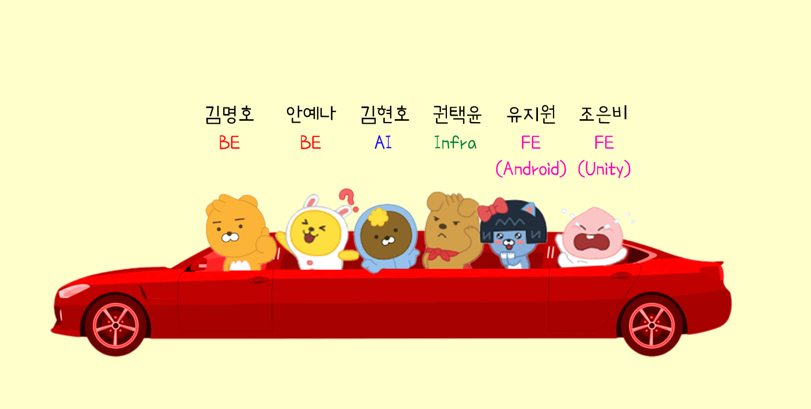
### [AI]
- 김현호 : AI 모델 학습 및 배포, 데이터전처리

### [FE]
- 유지원 : Android 앱 개발, UI/UX
- 조은비 : Unity 앱 개발 (AR 실내 네비게이션), UI/UX

### [Infra]
- 권택윤

### [BE]
- 안예나 : BE, REST API, DB, 디자인
- 김명호 : 팀장, BE, CI/CD, DB, FE(AR)


